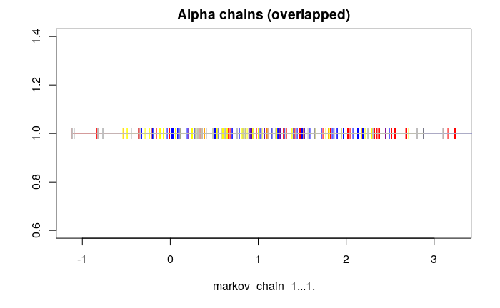
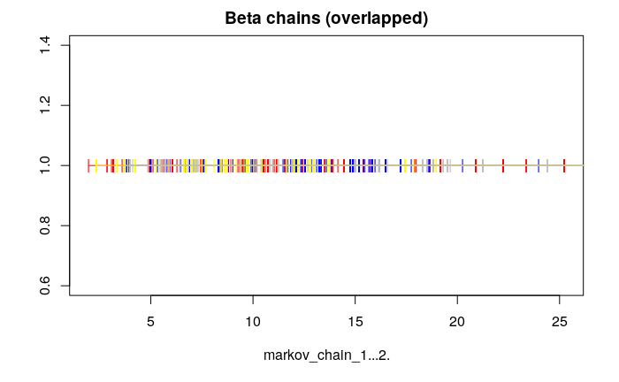
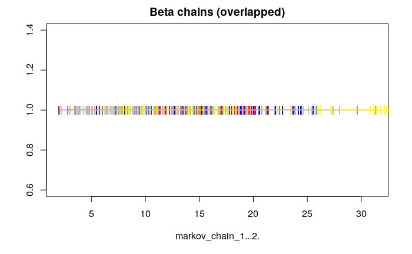
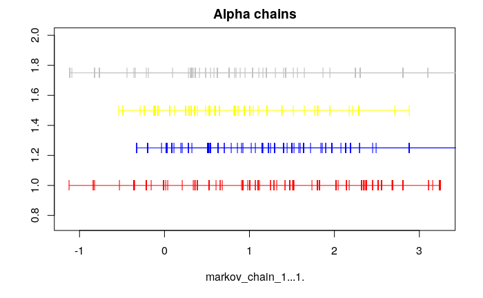
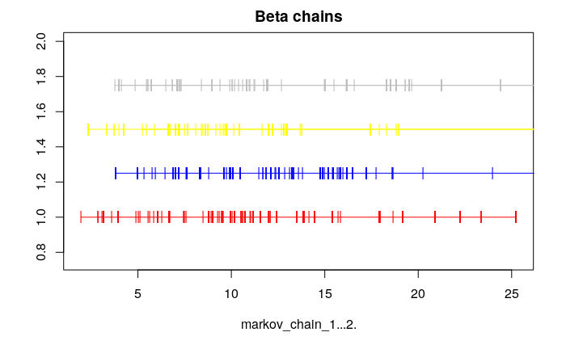
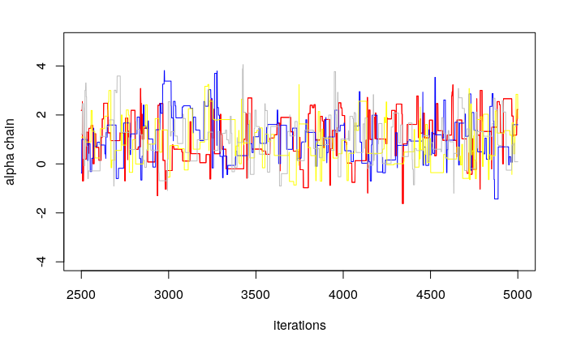
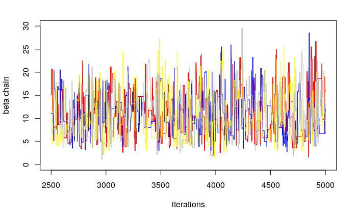
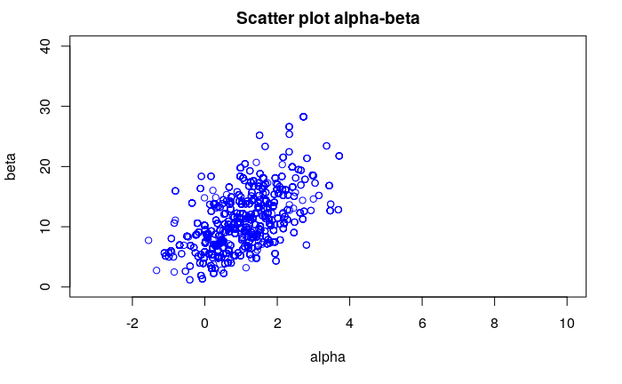
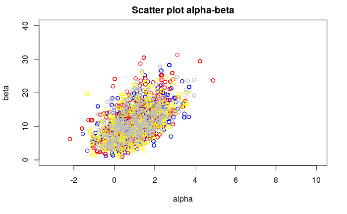

$\pagebreak$

# Load packages
```{r}
library(aaltobda)
library("rstan")

data("bioassay_posterior")
data("bioassay")
head(bioassay_posterior)
bioassay
```

# Exercise 1

```{r}
# Density ratio function
density_ratio <- function(alpha_propose, alpha_previous, beta_propose,
                          beta_previous, x, y, n){
  p_propose <- bioassaylp(alpha_propose, beta_propose, x, y, n)
  p_previous <- bioassaylp(alpha_previous, beta_previous, x, y, n)
  
  # Add the prior
  mean <- c(0,10)
  sigma <- matrix(c(4, 10, 10, 100),2)
  x_vector_propose <- c(alpha_propose, beta_propose)
  log_prior_propose <- dmvnorm(x_vector_propose, mean=mean, sigma=sigma, log = TRUE)
  
  x_vector_previous <- c(alpha_previous, beta_previous)
  log_prior_previous <- dmvnorm(x_vector_previous, mean=mean, sigma=sigma, log = TRUE)

  log_propose <- p_propose +  log_prior_propose
  log_previous <-  p_previous + log_prior_previous

  division <- exp(log_propose - log_previous)
  return(division)
}

print(density_ratio(alpha_propose = 1.89, alpha_previous = 0.374, beta_propose = 24.76,
                    beta_previous = 20.04, x =  bioassay$x, y = bioassay$y,
                    n = bioassay$n))
```

```{r}
# Metropolis Algorithm
Metropolis_bioassay <- function(starting_point, iterations){
  markov_chain <- array(dim = c(iterations+1, 2))
  for (i in 1:iterations){
    if (i==1){
      markov_chain[1,] <- starting_point
      alpha_previous <- starting_point[1]
      beta_previous <- starting_point[2]
    }
    else{
      alpha_previous <- markov_chain[i-1,1]
      beta_previous <- markov_chain[i-1,2]
    }

    alpha_propose <- rnorm(1, alpha_previous, 3)
    beta_propose <- rnorm(1, beta_previous, 12)
    ratio <- density_ratio(alpha_propose=alpha_propose, alpha_previous=alpha_previous, 
                           beta_propose=beta_propose, beta_previous=beta_previous, 
                           x=bioassay$x, y=bioassay$y, n=bioassay$n)
 
    if (runif(1) < ratio){
      markov_chain[i+1, 1] <- alpha_propose
      markov_chain[i+1, 2] <- beta_propose
      markov_chain
    }
    else{
      markov_chain[i+1, 1] <- markov_chain[i, 1]
      markov_chain[i+1, 2] <- markov_chain[i, 2]
    }
    
    if (i>1){
      p1 <- c(markov_chain[i-1,1], markov_chain[i-1,2])
      p2 <- c(markov_chain[i,1], markov_chain[i,2])
    }
    
  }
  return(markov_chain)
}

# Number of iterations
it = 5000

starting_point_1 <-c(floor(runif(2, min=1, max=10)))
starting_point_1
markov_chain_1 <- Metropolis_bioassay(starting_point=starting_point_1, iterations=it)
min_x <- min(markov_chain_1[,1])-1
max_x <- max(markov_chain_1[,1])+1
min_y <- min(markov_chain_1[,2])-1
max_y <- max(markov_chain_1[,2])+1
x_lim_1 <- c(min_x, max_x)
y_lim_1 <- c(min_y, max_y)

starting_point_2 <-c(floor(runif(2, min=1, max=10)))
starting_point_2
markov_chain_2 <- Metropolis_bioassay(starting_point=starting_point_2, iterations=it)
min_x <- min(markov_chain_2[,1])-1
max_x <- max(markov_chain_2[,1])+1
min_y <- min(markov_chain_2[,2])-1
max_y <- max(markov_chain_2[,2])+1
x_lim_2 <- c(min_x, max_x)
y_lim_2 <- c(min_y, max_y)


starting_point_3 <-c(floor(runif(2, min=1, max=10)))
starting_point_3
markov_chain_3 <- Metropolis_bioassay(starting_point=starting_point_3, iterations=it)
min_x <- min(markov_chain_3[,1])-1
max_x <- max(markov_chain_3[,1])+1
min_y <- min(markov_chain_3[,2])-1
max_y <- max(markov_chain_3[,2])+1
x_lim_3 <- c(min_x, max_x)
y_lim_3 <- c(min_y, max_y)


starting_point_4 <-c(floor(runif(2, min=1, max=10)))
starting_point_4
markov_chain_4 <- Metropolis_bioassay(starting_point=starting_point_4, iterations=it)
min_x <- min(markov_chain_4[,1])-1
max_x <- max(markov_chain_4[,1])+1
min_y <- min(markov_chain_4[,2])-1
max_y <- max(markov_chain_4[,2])+1
x_lim_4 <- c(min_x, max_x)
y_lim_4 <- c(min_y, max_y)
```


```{r eval=FALSE, include=FALSE}
x_1 <- data.frame(markov_chain_1[,1], 1)
x_2 <- data.frame(markov_chain_2[,1], 1) 
x_3 <- data.frame(markov_chain_3[,1], 1)
x_4 <- data.frame(markov_chain_4[,1], 1)
plot(x_1[it/2:it,], type = 'o', pch = '|', ylab = '', col="red", main = "Alpha chains (overlapped)")
points(x_2[it/2:it,], type='o', pch='|', ylab='', col="blue")
points(x_3[it/2:it,], type='o', pch='|', col="yellow")
points(x_4[it/2:it,], type='o', pch='|', col="grey")

x_2 <- data.frame(markov_chain_2[,1], 1.25) 
x_3 <- data.frame(markov_chain_3[,1], 1.5)
x_4 <- data.frame(markov_chain_4[,1], 1.75)
plot(x_1[it/2:it,], ylim = c(0.75, 2), type = 'o', pch = '|', ylab = '', col="red", main = "Alpha chains")
points(x_2[it/2:it,], type='o', pch='|', ylab='', col="blue")
points(x_3[it/2:it,], type='o', pch='|', col="yellow")
points(x_4[it/2:it,], type='o', pch='|', col="grey")


# Plotting beta
y_1 <- data.frame(markov_chain_1[,2], 1)
y_2 <- data.frame(markov_chain_2[,2], 1) 
y_3 <- data.frame(markov_chain_3[,2], 1)
y_4 <- data.frame(markov_chain_4[,2], 1)
plot(y_1[it/2:it,], type = 'o', pch = '|', ylab = '', col="red", main="Beta chains (overlapped)")
points(y_2[it/2:it,], type='o', pch='|', ylab='', col="blue")
points(y_3[it/2:it,], type='o', pch='|', col="yellow")
points(y_4[it/2:it,], type='o', pch='|', col="grey")

y_2 <- data.frame(markov_chain_2[,2], 1.25) 
y_3 <- data.frame(markov_chain_3[,2], 1.5)
y_4 <- data.frame(markov_chain_4[,2], 1.75)
plot(y_1[it/2:it,], ylim = c(0.75, 2), type = 'o', pch = '|', ylab = '', col="red", main="Beta chains")
points(y_2[it/2:it,], type='o', pch='|', ylab='', col="blue")
points(y_3[it/2:it,], type='o', pch='|', col="yellow")
points(y_4[it/2:it,], type='o', pch='|', col="grey")


x_scatter <- markov_chain_2[,1]
y_scatter <- markov_chain_2[,2]
plot(x_scatter[it/2:it], y_scatter[it/2:it], xlim=x_lim_1, ylim=y_lim_1, xlab="alpha", ylab="sigma", col="blue", main="Scatter plot alpha-beta")
points(starting_point_1[1], starting_point_1[2], col="red")
```


# Exercise 2

## a)

Metropolis-Hastings allows us to draw samples from a "target distribution", whose parameters are unknown, by approximating it with other distributions that are modified in each step iteration in order to improve them and get them closer to the target one, or, in other words, to make them converge to the target distribution. It is a Markov Chain Simulation method, used when it is not possible to directly draw from the target distribution. The target distribution is the stationary distribution of the Markov Chain. Each of the samples that are drawn from the proposal distribution is called candidate sample and it can be accepted or rejected depending on a criteria based on the computation of a ratio.
$\linebreak$
Given the target distribution: $p(\theta) \propto g(\theta)$, the pseudocode for the Metropolis-Hastings algorithm proceeds as following:

1. Choose an initial value for $\theta_0$
2. For t=1...Iterations:
  * Draw a candidate sample from the proposal distribution: $\theta^* \sim q(\theta^* | \theta_{t-1})$
  * Compute the ratio of densities, r.
  * Depending on the value of the ratio, the candidate $\theta^*$ is accepted as $\theta_t$ or rejected, so $\theta_t = \theta_{t-1}$:
$$
\theta_i =
\left\lbrace
\begin{array}{ll}
\theta^* \textrm{ with probability min(r,1)}\\
\theta_{i-1} \textrm{ otherwise}
\end{array}
\right. 
$$

## b)

The chosen proposals are based on the example ones:
$$ \alpha^* \sim N(\alpha_{t-1}, \sigma = 3)$$
$$ \beta^* \sim N(\beta_{t-1}, \sigma = 12)$$
In order to choose the values of $\sigma$, the resulting plots were studied. 
In the figures 1 and 2, the four chains for alpha and beta are represented using the chosen proposal distributions. As it is shown, there is a clear convergence towards one point. In other cases, such as the ones in the figures 3 and 4, for which the proposal distributions have $\sigma=1$ and $\beta=5$, the points have a higher dispersion and the convergence is not as recognizable as in the previous case.

{width=5, height=5, align=center}

{width=5, height=5, align=center}

{width=5, height=5, align=center}

{width=5, height=5, align=center}

For higher values of $\sigma$, the acceptance rate of the Metropolis algorithm is lower, meaning that there are more rejected candidate values, so the convergence is slower and the performance, in general, is worse. This is the reason why the previous distributions were selected. To summarize, the chosen distributions meet the following requirements, stated in the book BDA3:

* It is easy to sample from the proposal distribution.
* It is easy to compute the ratio.
* Each jump goes a reasonable distance in the parameter space.
* The jumps, as explained before, are not rejected too frequently.

$\pagebreak$

## c)

The ideal method would be choosing overdispersed starting points for each parameter. In the given case, the way they were chosen is by making use of a random number generator built-in function. The following line of code selects two integers randomly in the given range:
```{r eval = FALSE}
starting_point <- c(floor(runif(2, min=1, max=10)))
```


## d)

The chains were built by iterating the Metropolis algorithm a total number of 5000 times, meaning that this is the length of each of the chains. The reason why this number was chosen is based on graphical evidence by carrying out a trial error process using graphs as the previously shown in figures 1 to 4 and scatter plots like the one below in this report.

## e)
The warm-up length is used to "*diminish the influence of the starting values*" (BDA3). As proposed in the book, half of each sequence is discarded, meaning that the final number of points is 2500.

## f)
In the given case, four Metropolis chains were computed. The ones for alpha are represented in the figure 5, while the ones for beta are represented in the figure 6.

{width=5, height=5, align=center}

{width=5, height=5, align=center}

## g)

```{r include=FALSE}
# Plotting alpha 
iter <- seq(from = it/2, to = it, by = 1)
a = it/2
b = it

x_1 <- c(markov_chain_1[,1])
x_1 <- x_1[a:b]

x_2 <- c(markov_chain_2[,1])
x_2 <- x_2[a:b]

x_3 <- c(markov_chain_3[,1])
x_3 <- x_3[a:b]

x_4 <- c(markov_chain_4[,1])
x_4 <- x_4[a:b]


plot(iter, x_1, col="red", ylim=c(-4,5), ylab="alpha chain", xlab="iterations", type="l")
lines(iter, x_1, col="red")
#points(iter, x_2, col="blue")
lines(iter, x_2, col="blue")
#points(iter, x_3, col="yellow")
lines(iter, x_3, col="yellow")
#points(iter, x_4, col="grey")
lines(iter, x_4, col="grey")
```

```{r include=FALSE}
# Plotting beta 
iter <- seq(from = it/2, to = it, by = 1)
a = it/2
b = it

y_1 <- c(markov_chain_1[,2])
y_1 <- y_1[a:b]

y_2 <- c(markov_chain_2[,2])
y_2 <- y_2[a:b]

y_3 <- c(markov_chain_3[,2])
y_3 <- y_3[a:b]

y_4 <- c(markov_chain_4[,2])
y_4 <- y_4[a:b]


plot(iter, y_1, col="red", ylim=c(0,30), ylab="beta chain", xlab="iterations", type="l")
lines(iter, y_1, col="red")
#points(iter, x_2, col="blue")
lines(iter, y_2, col="blue")
#points(iter, x_3, col="yellow")
lines(iter, y_3, col="yellow")
#points(iter, x_4, col="grey")
lines(iter, y_4, col="grey")
```

All chains for $\alpha$ in a single line-plot are represented in figure 7.

{width=5, height=5, align=center}

## h)
All chains for $\beta$ in a single line-plot are represented in figure 8.

{width=5, height=5, align=center}

$\pagebreak$

# Exercise 3
```{r}
sim_alpha <- array(c(x_1, x_2, x_3, x_4), dim = c(length(x_1), 4))
sim_beta <- array(c(y_1,y_2,y_3,y_4), dim=c(length(y_1),4))
R_alpha <-Rhat(sim_alpha)
R_alpha
R_beta <- Rhat(sim_beta)
R_beta

```
R is a metric that involves the variance between two parameters, B and W:

* B measures the between sequence variance, meaning how different is each sequence from the others.
* W measures the within sequence variance, meaning how different parameters within the same sequence are.

The expression for R, according to BDA3 is:

$$  
`R_{metric} = \sqrt[2]{(\frac{`var^+(\phi|y)}{W})}
$$

For a greater number of samples, the previous metric tends to 1, meaning that the variability of the two parameters previously described is really small. It is an analogous concept to the clusterization metrics, in which inter-cluster and intra-cluster similarity must be compared in order to decide if a clusterization was succesful.

In the given case, with 5000 iterations,  the metric (the 2500 warm-up iterations are not included for the calculation) for $\alpha$ is $`R_{metric, alpha}=$ `r R_alpha` $<1.05$ and the one for $\beta$ is $`R_{metric, beta} =$ `r R_beta`$< 1.05$. In both cases, the value is close to 1 and, according to the Stan documentation, when having a lower metric than 1.05, then, the sample can be accepted, which is the current situation.

$\linebreak$
A good measure was not obtained at first try. The number of iterations had to be increased, because initially, the first trials were performed with less than a thousand steps.

# Exercise 4

```{r eval=FALSE}
plot(x_2, y_2, xlim=x_lim_1, ylim=y_lim_1, xlab="alpha", ylab="beta", col="blue",
     main="Scatter plot alpha-beta")
points(x_1, y_1, col="red")
points(x_3, y_3, col="yellow")
points(x_4, y_4, col="grey")
```
Finally, the scatter plot for the draws $\alpha$ and $\beta$ is included in the following figure.

{width=5, height=5, align=center}

In the figure 10, there is the scatter plot considering the draws from all the four chains.

{width=5, height=5, align=center}
