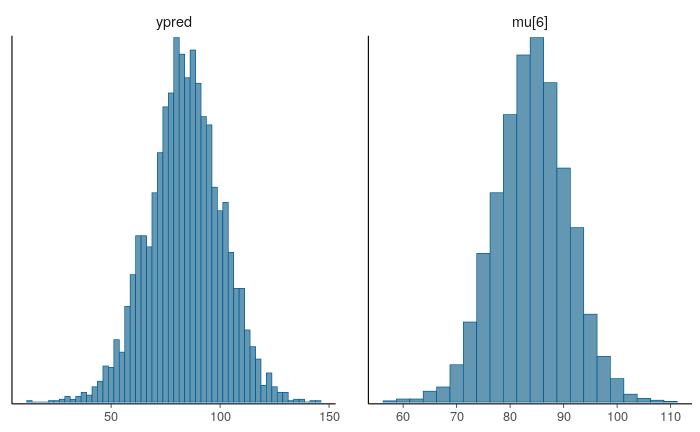

$\pagebreak$

# Load packages
```{r eval=FALSE}
library(aaltobda)
library("rstan")
library(magrittr)
library(tidyr)

library(loo)
library(ggplot2)
library(gridExtra)
library(bayesplot)
theme_set(bayesplot::theme_default(base_family = "sans"))
#library(shinystan)
library(rprojroot)


SEED <- 48927 # set random seed for reproducability
```

```{r include=FALSE}
library(aaltobda)
library("rstan")
library(magrittr)
library(tidyr)

library(loo)
library(ggplot2)
library(gridExtra)
library(bayesplot)
theme_set(bayesplot::theme_default(base_family = "sans"))
#library(shinystan)
library(rprojroot)


SEED <- 48927 # set random seed for reproducability
```

```{r}
data("drowning")
```

# Exercise 1

## 1
The three errors are represented in the following image:

{align=center}

* There is a mistake in the definition of the standard deviation, sigma, in line 10. It must be constrained to be positive. However, in the original code, it is constrained to be smaller than 0. Hence, in order to solve the error, it must be defined as: real < lower=0 > sigma;
* A syntax mistake can be found in line 16. Every stan code line must end with a semicolon. Hence, to solve the error, it is enough to add it: y ~ normal(mu, sigma);
* Finally, there is another mistake in the definition of the predicted samples, line 19. When establishing the parameters of the normal distribution for the simulated samples, the mean must depend on the prediction year. Instead, it was defined depending on the observation one. In order to solve it: real ypred = normal_rng(alpha+beta*xpred, sigma);

The fixed code is:
```{r eval=FALSE}
data {
  int < lower =0 > N ; // number of data points
  vector [ N ] x ;
  // observation year
  vector [ N ] y ;
  // observation number of drowned
  real xpred ;
  // prediction year
  real pmualpha;  // prior mean for alpha
  real psalpha;   // prior std for alpha
  real pmubeta;   // prior mean for beta
  real psbeta;    // prior std for beta
}
parameters {
  real alpha ;
  real beta ;
  real < lower =0 > sigma ;
}
transformed parameters {
  vector [ N ] mu = alpha + beta * x ;
}
model {
  alpha ~ normal(pmualpha, psalpha);  // prior
  beta ~ normal(pmubeta, psbeta); // prior
  y ~ normal ( mu , sigma );
}
generated quantities {
  real ypred = normal_rng ( alpha+beta*xpred, sigma );
}
```

## 2
In order to compute the standard deviation of the weakly-informative prior for the slope beta, the calculation can be based on the quantiles. Knowing that $Pr(-69 < beta < 69) =0.99$, then, the function qnorm can be used to find out what value of the standard deviation yields -69 and 69. Since:
$$
Pr(-69 < beta < 69)=Pr(beta<69)-Pr(beta<-69)=0.99
$$
Then, 69 corresponds with the quantil 99.5%, while -69 represents the quantil 0.5%. Different standard deviations are tried until the values 69 and -69 are obtained.

```{r}
qnorm(c(0.005,0.995), 0, 27)
```
The obtained value, 27, is a reasonable value. According to the plot of a normal distribution, as it is shown in the figure 2, it makes sense to obtain a value higher than 23, since:
$$
\sigma_\beta > \frac{69--69}{6}=23
$$

{width=5, height=5, align=center}

Hence, the chosen value is:
$$
\sigma_\beta=27
$$

## 3
In order to implement in the code the prior, inside the block corresponding to model, the following line was added:

* beta ~ normal(pmubeta, psbeta);

Where, pmubeta is 0, as specified in the exercise, and psbeta is the previously obtained value $\sigma_\beta=27$.

## 4
In order to add a weakly informative prior for the intercept alpha, another normal distribution with zero mean can be used. The standard deviation must be a high value, in order to make it weakly informative, somehow related to the context of the problem. As stated in the book BDA3, *in the general problem of estimating a normal mean, a $N(0,A^2)$ prior distribution is weakly informative, with $A$ set to some large value that depends on the context of the problem*. The chosen value for $\sigma_alpha$ is the square mean of the drownings:
```{r}
mean(drowning$drownings)
```
Hence, the chosen value is:
$$
\sigma_\alpha=135^2 
$$
$\pagebreak$
In the figure 3, the plots obtained from the execution are shown:

{width=5, height=5, align=center}


```{r eval=FALSE, include=FALSE}
data_lin <-list(N = nrow(drowning),
             x = drowning$year,
             xpred = 2020,
             y = drowning$drownings)
```


```{r eval=FALSE, include=FALSE}
data_lin_priors <- c(list(
    pmualpha = 0,
    psalpha = 135^2,
    pmubeta = 0, # a priori incr. and decr. as likely
    psbeta = 27), 
    data_lin)
```

```{r eval=FALSE, include=FALSE}
data_fit <- stan(
  file = "model1.stan",  # Stan program
  data = data_lin_priors,    # named list of data
  seed = SEED             # no progress shown
  )
```


```{r eval=FALSE, include=FALSE}
draws_lin <- rstan::extract(data_fit, permuted = T)
```


```{r eval=FALSE, include=FALSE}
mu <- apply(draws_lin$mu, 2, quantile, c(0.05, 0.5, 0.95)) %>%
  t() %>% data.frame(x = data_lin$x, .)  %>% gather(pct, y, -x)

pfit <- ggplot() +
  geom_point(aes(x, y), data = data.frame(data_lin), size = 1) +
  geom_line(aes(x, y, linetype = pct), data = mu, color = 'red') +
  scale_linetype_manual(values = c(2,1,2)) +
  labs(y = 'drownings', x= "Year") +
  guides(linetype = F)
pars <- intersect(names(draws_lin), c('ypred'))
draws <- as.data.frame(data_fit)
phist <- mcmc_hist(draws, pars = pars, binwidth = 2.5)
pars2 <- intersect(names(draws_lin), c('beta'))
phist2 <- mcmc_hist(draws, pars = pars2, binwidth = 0.05) 
grid.arrange(pfit,phist,phist2,  nrow = 3)
```

$\pagebreak$

# Exercise 2

```{r}
data("factory")
```

## Separate model
In the separate model, each machine has its own model, meaning that they have different standard deviation $\sigma_j$ for each group $j$. The priors used are those suggested in the last part of this exercise, since they are weakly informative. 

### a
In this initial part of the exercise, the entire code is included. However, it is not for the next questions (hierarchical and pooled models), since it is analogous.

The data required for running the model is defined and the model is implemented, yielding the following results for the plots:
```{r include=FALSE}
# Run stan for the separate model
separate_model <- stan_model("separate.stan")
separate_data <- list(y=factory,
                      N=nrow(factory),
                      J=ncol(factory),
                      p_mu=10,
                      p_alpha=1,
                      p_beta=1)

separate_sampling <- sampling(separate_model, data=separate_data)
```


The code for obtaining the required plots is:
```{r}
draws_separate <- rstan::extract(separate_sampling, permuted = T)

pars_separate <- intersect(names(draws_separate), c('ypred'))
draws_separate <- as.data.frame(separate_sampling)
phist_separate <- mcmc_hist(draws_separate, pars = c(pars_separate,
                                                     names(draws_separate)[6]),
                                                     binwidth = 2.5)
```

```{r eval=FALSE}
grid.arrange(phist_separate,  nrow = 1)
```
In the figure 4, the plots for answering the questions are included.

#### i
The posterior distribution of the mean represents the prior used for computing the likelihood. In this case, the histogram seems reasonable considering the values of the data set. It has the shape of a normal distribution with a mean around the value 50 and a standard deviation that could be around 10.

#### ii
The predictive distribution for another quality measure of the sixth machine represents the distribution that follows a simulated sample for the sixth machine. It is implemented in the model block "generated quantities". In the given case, it is highly probable that the next measure would be around 50, since the distribution is normal with mean around the mentioned value.

#### iii
Since comparison between k groups is being performed, there is no possibility to extend the knowledge to a seventh machine. Instead, it is possible to obtain simulations of the future quality measures of one of the machines, as it was done in the previous question.

{width=5, height=5, align=center}

$\pagebreak$

### b
The code for the Stan model is:
```{r eval=FALSE}
data {
  int < lower =0 > N ;
  int < lower =0 > J ;
  vector [ J ] y [ N ];
  int p_mu;
  int < lower =0 > p_alpha;
  int < lower =0 > p_beta;
}
parameters {
  vector [ J ] mu ;
  vector < lower =0 >[ J ] sigma ;
}
model {
  // priors
  for ( j in 1: J ){
    mu [ j ] ~ normal (0 , p_mu);
    sigma [ j ] ~ gamma (p_alpha, p_beta);
  }
  // likelihood
  for ( j in 1: J )
    y [ , j ] ~ normal ( mu [ j ] , sigma [ j ]);
}
generated quantities {
  real ypred ;
  // Compute predictive distribution for the sixth machine
  ypred = normal_rng ( mu [6] , sigma [6]);
}
```

As priors, the suggested ones were used, a Normal distribution for the mean and a Gamma distribution for the standard deviation. Since it is a separate model, both priors are included in the for loop, yielding different results for each of the groups that are considered (machines).


### c
The mathematical formulation of the model is:
$$y_{ij} \sim N(\mu_j, \sigma_j)$$
$$\mu_j \sim N(0, 10)$$
$$\sigma_j \sim Gamma(1,1)$$

### d
The posterior expectation for $\mu_1$ can be obtained as:
```{r}
monitor(separate_sampling)
```
The 90% interval is defined by the Q95 and the Q5, hence, in the given case for the separate model and $\mu_1$ would be: [34.8, 64.3].

$\pagebreak$

## Hierarchical
In a hierarchical model, a multilevel modeling process is considered, assuming that the prior distributions depend on an upon further hyperparameters that are obtained from a hyperprior distributions.

### a
```{r include=FALSE}
# Run stan for the separate model
hierarchical_model <- stan_model("hierarchical.stan")
hierarchical_data <- list(y=factory,
                      N=nrow(factory),
                      J=ncol(factory),
                      p_mu=10,
                      p_alpha=1,
                      p_beta=1)

hierarchical_sampling <- sampling(hierarchical_model, data=hierarchical_data)
```


```{r include=FALSE}
draws_hierarchical <- rstan::extract(hierarchical_sampling, permuted = T)

pars_hierarchical <- intersect(names(draws_hierarchical), c('ypred'))
draws_hierarchical <- as.data.frame(hierarchical_sampling)
phist_hierarchical<- mcmc_hist(draws_hierarchical, pars = c(pars_hierarchical,names(draws_hierarchical)[6]), binwidth = 2.5)
```

```{r include=FALSE}
grid.arrange(phist_hierarchical,  nrow = 1)
```
In the figure 5 there is the representation of the plots used for answering the questions:

#### i
The posterior distribution of the mean of the quality measurements for the sixth machine follows a normal distribution with mean around 85 and standard deviation around 8. The hierarchical model is used so the population is not described by only one set of parameters, since another level is added. Hence, the obtained distribution should be more realistic than in the previous case.

#### ii
The predictive distribution for another quality measurement follows a normal distribution with mean around 90 and standard deviation around 20. It is similar to the one obtained in the previous case but slightly displaced towards the right.

#### iii
Since comparison between k groups is being performed, there is no possibility to extend the knowledge to a seventh machine. Instead, it is possible to obtain simulations of the future quality measures of one of the machines, as it was done in the previous question.

{width=5, height=5, align=center}

### b
The code for the model is:
```{r eval=FALSE}
data {
  int < lower =0 > N ;
  int < lower =0 > J ;
  vector [ J ] y [ N ];
  int < lower =0 > p_mu;
  int < lower =0 > p_alpha;
  int < lower =0 > p_beta;
}
parameters {
  vector [ J ] mu ;
  real tau;
  real theta;
  real sigma ;
}
model {
  // Hyperpriors
  tau ~ normal(0, p_mu);
  theta ~ gamma(p_alpha, p_beta);
  
  // Priors
  for (j in 1: J ){
    mu[ j ] ~ normal (0, tau);
  }
  sigma ~ inv_chi_square (theta);
  // likelihood
  for ( j in 1: J )
    y [ , j ] ~ normal ( mu [ j ] , sigma);
}
generated quantities {
  real ypred ;
  // Compute predictive distribution for the sixth machine
  ypred = normal_rng ( mu [6] , sigma);
}
```

### c
The model expressed in mathematical notation is:

$$
y_{ij} \sim N(\mu_j, \sigma)$$
$$
Hyperpriors:$$
$$
\tau \sim N(0,10)$$
$$\theta \sim Gamma(1,1)$$
$$Priors: $$
$$\mu_j \sim N(0, \tau)$$
$$\sigma \sim inv-X^2(\theta)
$$

### d
The posterior expectation for $\mu_1$ can be obtained as:
```{r}
monitor(hierarchical_sampling)
```
The posterior expectation for $\mu_1$ with a 90% credibility interval is given by [63.2, 84.9].

$\pagebreak$

## Pooled
In the pooled model, all measurements are combined and no distinction is made between machines.

### a
```{r include=FALSE}
# Run stan for the separate model
pooled_model <- stan_model("pooled.stan")
pooled_data <- list(y=factory,
                    N=nrow(factory),
                    J=ncol(factory),
                    p_mu=10,
                    p_alpha=1,
                    p_beta=1)

pooled_sampling <- sampling(pooled_model, data=pooled_data)
```

```{r include=FALSE}
draws_pooled <- rstan::extract(pooled_sampling, permuted = T)

pars_pooled <- intersect(names(draws_pooled), c('ypred'))
draws_pooled <- as.data.frame(pooled_sampling)
phist_pooled <- mcmc_hist(draws_pooled, pars = c(pars_pooled,names(draws_pooled)[1]), binwidth = 2.5)
```

```{r include=FALSE}
grid.arrange(phist_pooled,  nrow = 1)
```
In the figure 6, the necessary plots for ansering the questions are included.

#### i
In the given case, it does not make sense to differentiate between the existing machines, since all the data is treated as if it was coming from only one machine. Hence, the posterior distribution of the only considered machine is shown in the figure 6. It follows a normal distribution with mean around 85, similar to the previous case.

#### ii
The predictive distribution for another quality measure is also computed for the "general" machine that the pooled model considers, instead of the sixth one. It yields a normal distribution with mean around 80.

#### iii
Since comparison between k groups is being performed, there is no possibility to extend the knowledge to a seventh machine. Instead, it is possible to obtain simulations of the future quality measures of one of the machines, as it was done in the previous question.


{width=5, height=5, align=center}

### b
The code for the stan model is:
```{r eval=FALSE}
data {
  int < lower =0 > N ;
  int < lower =0 > J ;
  vector [ J ] y [ N ];
  int < lower =0 > p_mu;
  int < lower =0 > p_alpha;
  int < lower =0 > p_beta;
}
parameters {
  real mu ;
  real sigma ;
}
model {
  // priors
  mu ~ normal (0 , p_mu);
  sigma  ~ gamma (p_alpha, p_beta);
  // likelihood
  for ( j in 1: J )
    y [ , j ] ~ normal ( mu  , sigma );
}
generated quantities {
  real ypred ;
  // Compute predictive distribution for the first machine
  ypred = normal_rng ( mu, sigma);
}
```

### c
The model, described in mathematical notation is:
$$
y \sim N(\mu, \sigma)$$
$$\mu \sim N(0, 10)$$
$$\sigma \sim Gamma(1,1)
$$

### d
Finally, the posterior expectation for $\mu$ is computed from the 90% credibility interval:
```{r}
monitor(pooled_sampling)
```
It yields a result of [79.8, 85.6].

## Difference between the models
The separate model, in which the standard deviation and mean are considered as dependent on each of the existing groups yields results that are less realistic than the hierarchical one, in which the assumption that only a set of data represents the population is removed by establishing a multilevel approach. Finally, in the pooled model, the results are also better than in the separate one but not as good as in the hierarchical.
